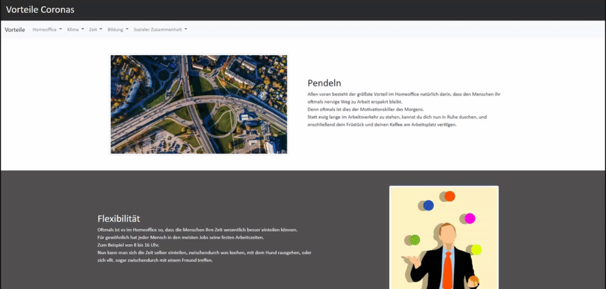

# Pros of the corona pandemic

Study task was to create anything, that also points out some of the positive aspects of the pandemic, rather then just the negative ones. 
So me and my colleague decided to create a website, since we have never done anything like it before. 

I learned how to structure a website in html on my own, design the layout in css and add effects, such as the slide and blend in and out by using JavaScript. 
Because the structure of the website remained the same throughout the different arguments, that we outlined, I came across the templating library called EJS (Embedded JavaScript) to make the Website more flexible in case of changes.  
In the backend, to set up the server, I used the node.js framework called Express, since it just seemed way more simple, than just doing it without it.  

